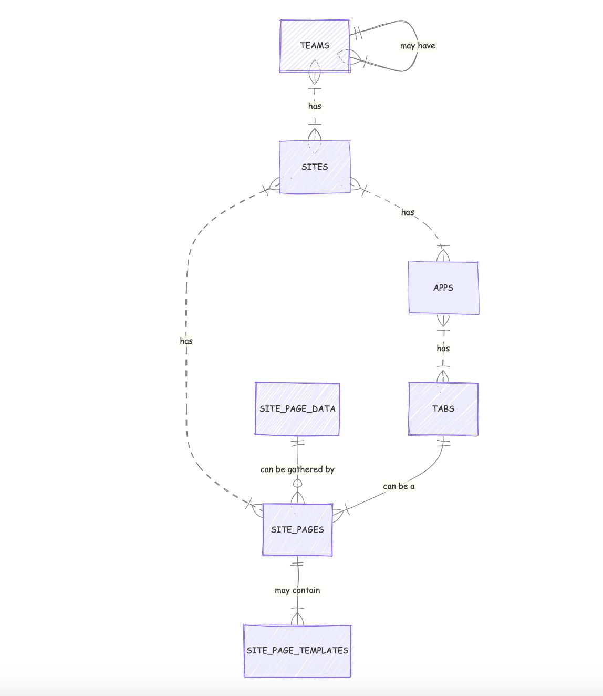

# User Guide

# Prasso User Documentation Manual

## 1. Introduction to Prasso

Prasso is a multi-tenant application that serves multi-tenant applications. It's built with Laravel and leverages Laravel Teams, with enhanced teams that can have sub-teams. 

Prasso is a platform that streamlines the app prototype process for owners by providing a wizard-like framework for gathering the necessary details and building custom mobile and web apps.

With Prasso, you can create both your app API backend and your website with one setup form. You can then use the admin tools to customize these with branding and content.

## 2. Key Concepts

### 2.1 Users and Teams
- Users belong to teams. Users can be invited to a team or can own their own private team.
- When a user registers, a private team is assigned. Users can also be included in other teams.
- A team owner is one who has been assigned to admin a team or who has created the team.
- Teams are the basic unit in a social group. Teams have owners (coaches) and members.

### 2.2 Sites
- Teams own sites. Everything is based on a site.
- A site is determined by its URL and has assigned attributes that determine the appearance of the site.
- A Prasso site is both a business information site and a Prasso API site. The API serves the Prasso apps.
- Sites have site pages. These can be created and maintained.
- Sites are the landing page of the App home website. Example Prasso sites: https://faxt.com, https://barimorphosis.com, https://lileyscapes.faxt.com, https://mercyfullfarms.com

### 2.3 Apps
- Sites can have an APP. When a user who is a member of a team logs into the Prasso app, the default-designated app will be loaded for use.
- Apps have an association to a site.
- An app is configured with tabs that point to views.
- An app is identified at the backend by the host of the request.
- The host is associated with the site, the site is associated with the app.

### 2.4 Tabs
- Apps have tabs. Users "build" their apps in the Prasso Admin tool.
- App tabs are web page URLs. Custom header information can be sent to the URL with the request to enable application-specific sessions.
- Changing the tab configuration of an app is done through the admin panel.

### 2.5 Roles
- Users have roles. There are three tiers of user roles: Super-Admin, Site Admin, and App User.
- Allow anyone with a login to log into the app. No role is required.
- Site-admins can log into the sites they have an association with.
- Super-admins can access any site admin area.

## 3. How Prasso Works

### 3.1 Site and Page Loading
- At least one site must be configured in the site table (example: faxt.com).
- When the site loads, the host is checked to see if its URL/domain is recorded in the site table.
- If the site is recorded, the site object from the table is kept available in the app session for use.
- Site pages reference the site table, so if a site has pages, they can be used in the display as links.
- The landing page content is determined by the entry in the site pages table for the site with the label "Welcome".

### 3.2 Site Pages
- Site Pages are of two types: 1. an external URL or 2. masterpage and HTML content.
- If a site page is HTML content, it can also specify a data template to be used when the URL is loaded.
- Data templates are stored in the database and are associated with a site_page in the editor.

### 3.3 Data Templates
- There are two ways to embed a data template within a site page:
  1. Use [DATA] placeholder in the site page description.
  2. Use JavaScript to send a request for template data to an API endpoint.

### 3.4 Creating a Site Page Template
1. Create an HTML form with a placeholder that will be replaced by the template.
2. Create a template and add its name as a record to the site_templates table.
3. Edit the site page record and specify the newly created data template as the template.

## 4. Technical Details

### 4.1 Database Structure
Prasso uses several database tables to manage its structure. Key tables include:
- prasso.users
- prasso.teams
- prasso.team_user
- prasso.sites
- prasso.team_site
- prasso.apps
- prasso.tabs

### 4.2 API Backend
The API backend is based on the Laravel framework. It is used to feed application structure information to a Prasso app and site.

## 5. License
Prasso is licensed under the [MIT license](https://opensource.org/licenses/MIT).

The Laravel framework is open-sourced software licensed under the [MIT license](https://opensource.org/licenses/MIT).

Would you like me to elaborate on any specific section or add more details to this structure?

[Getting Started](./getting-started.md)